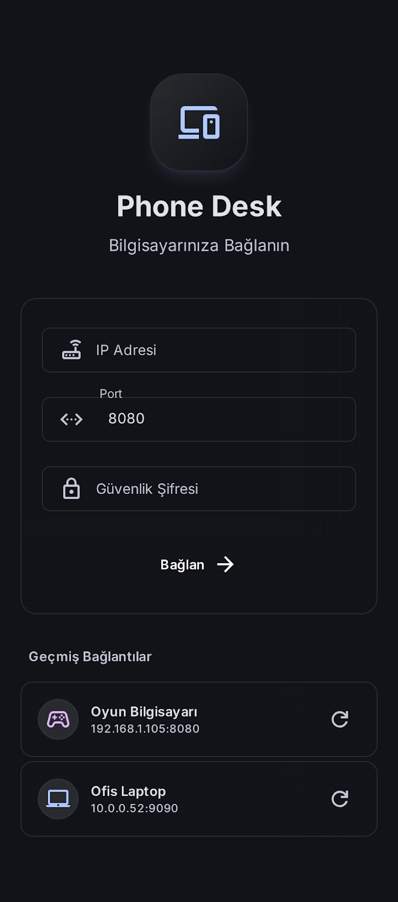
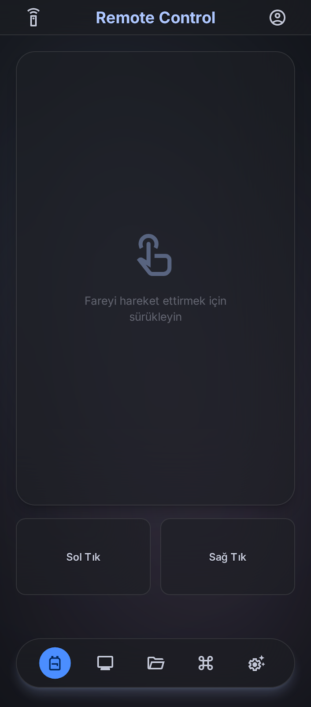
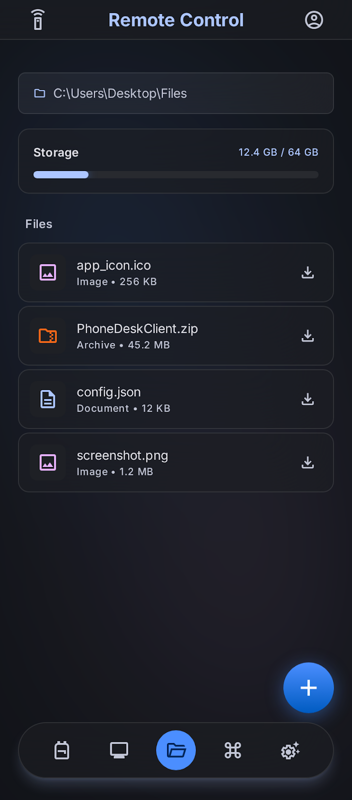
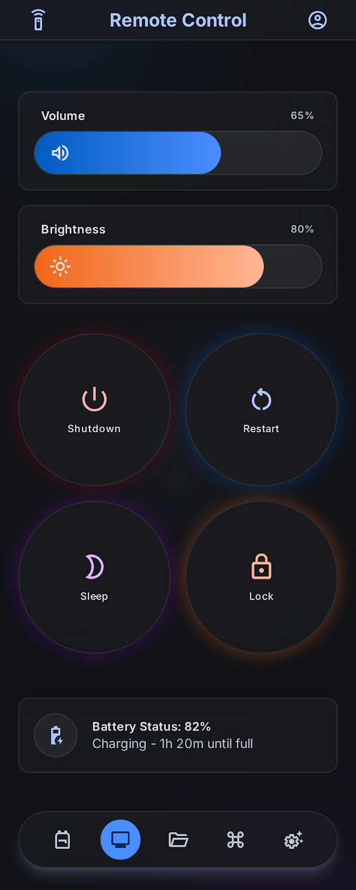

  
  <h1>Phone Desk</h1>
  
<strong>Bilgisayarınızı Telefonunuzdan Canlı ve Kesintisiz Yönetin!</strong>

 

**Phone Desk**, bilgisayarınızı akıllı telefonunuz üzerinden (yerel ağ bağlantısı ile) tam kapsamlı olarak kontrol etmenizi sağlayan güçlü ve estetik bir araçtır. Yeni nesil **"Liquid Glass" (Cam Tasarımı)** arayüzü ile iOS, Android ve Web Tarayıcılarında muhteşem bir deneyim sunar. 

---

## 📸 Ekran Görüntüleri

| Bağlantı Ekranı | Akıllı Touchpad |
| :---: | :---: |
|  |  |
| **Gelişmiş Dosya Yöneticisi** | **Sistem & Güç Kontrolü** |
|  |  |

---

## 🌟 Öne Çıkan Özellikler

- **📱 Modern "Liquid Glass" Arayüz:** Pürüzsüz ve karanlık temalı üst düzey bir tasarım deneyimi.
- **🎮 Canlı Ekran Kontrolü:** Çoklu monitör desteği ve ayarlanabilir çözünürlük/FPS ile PC ekranını telefona yansıtma.
- **🖱️ Çift Dokunuşlu Touchpad:** Sağ tık, sol tık ve **çift dokunup sürükleme (drag)** destekli hassas fare kontrolü.
- **📂 Dosya Yöneticisi:** PC dosyalarında gezinme, resim önizlemeleri ve telefona tek tuşla dosya indirme.
- **🎛️ Profil Destekli Stream Deck:** Uygulamalara özel kontrol panelleri ve kısayollar (OBS, Zoom, Medya vb.).
- **📊 Sistem Monitörü:** CPU, RAM kullanımları ve anında PC'yi kapatma, kilitleme seçenekleri.

---

## 🚀 Kurulum ve Başlangıç

Phone Desk, hem bilgisayarınızda (Sunucu) hem de telefonunuzda (İstemci) çalışacak iki parçadan oluşur.

### 1. Adım: Bilgisayar (Windows) Kurulumu
1. Sağ taraftaki **Releases** bölümünden (veya yukarıdaki Web arayüzü bağlantılarından) **`PhoneLink_Installer.exe`** dosyasını indirin.
2. Kurulumu tamamlayıp uygulamayı başlatın.
3. Uygulama size bir **Yerel IP Adresi** (Örn: `http://192.168.1.50:8080`) ve 6 haneli bir **Güvenlik Şifresi** verecektir.

### 2. Adım: Telefon (İstemci) Kurulumu

Telefonunuzun tarayıcısından doğrudan IP adresini girerek Web arayüzünü kullanabileceğiniz gibi, çok daha yüksek performans için yerel uygulamalarımızı kurabilirsiniz:

#### 🟢 Android (APK) Kurulumu:
1. **Releases** bölümünden **`app-release.apk`** dosyasını telefonunuza indirin.
2. Dosyayı açın ve "Bilinmeyen Kaynaklar" uyarısı verirse ayarlardan izin vererek kurulumu tamamlayın.
3. Uygulamayı açıp bilgisayarınızdaki IP adresi ve Şifreyi girerek bağlanın.

#### 🍎 iOS (IPA) AltStore ile Kurulumu:
Apple'ın kısıtlamaları nedeniyle uygulama henüz App Store'da değildir. Ancak `PhoneDeskClient.ipa` dosyasını ücretsiz olarak **AltStore** ile kurabilirsiniz:

1. **Hazırlık:** Bilgisayarınıza [AltServer](https://altstore.io/) uygulamasını indirin ve kurun. Telefonunuzda AltStore uygulamasının yüklü olduğundan emin olun.
2. **IPA'yı İndirin:** iPhone'unuzdaki Safari tarayıcısından bu GitHub sayfasının **Releases** bölümüne girip **`PhoneDeskClient.ipa`** dosyasını indirin (Dosyalar uygulamasına kaydedilir).
3. **AltStore'a Yükleme:**
   - iPhone'unuzdan **AltStore** uygulamasını açın.
   - Alt sekmeden **My Apps** (Uygulamalarım) bölümüne geçin.
   - Sol üst köşedeki **`+`** (Artı) ikonuna tıklayın.
   - Dosyalar uygulamasından indirdiğiniz `PhoneDeskClient.ipa` dosyasını seçin.
4. AltStore uygulamayı imzalayacak ve saniyeler içinde ana ekranınıza ekleyecektir. İşlem bitince uygulamayı açıp IP ve şifrenizle bilgisayarınıza bağlanabilirsiniz!

> [!TIP]
> AltStore ile yüklenen uygulamaların süresi 7 gündür. Bilgisayarınızla aynı Wi-Fi ağındayken AltStore arka planda otomatik olarak bu süreyi yeniler.

---
*(Not: Bilgisayarınız ve telefonunuzun aynı Wi-Fi ağına bağlı olması gerekmektedir.)*
